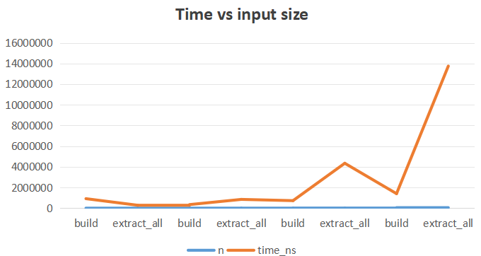

# Max-Heap Implementation

## Overview
This project implements a **Max-Heap** data structure in Java with core operations:
- `buildMaxHeap()`
- `insert()`
- `extractMax()`
- `increaseKey()`

The goal of this assignment is to demonstrate efficient heap operations, analyze time and space complexity, and validate performance through benchmarking.

## Algorithm Description
A Max-Heap is a complete binary tree where each node is greater than or equal to its children.  
The key operations are:
- **Insert:** Add an element and perform `heapifyUp` to maintain heap order.
- **Extract-Max:** Remove the maximum element (root) and `heapifyDown` from the root.
- **Increase-Key:** Increase a key and restore heap property using `heapifyUp`.

All operations run in **O(log n)** time, while `buildMaxHeap()` runs in **O(n)**.

## Performance Metrics
This implementation measures:
- Number of comparisons
- Number of swaps
- Execution time
- Recursion depth (if applicable)
- Memory usage estimate

Performance data is written to a CSV file for analysis in Excel.

## Empirical Analysis
The benchmark results were collected for input sizes `n = 100, 1000, 10000, 100000`.  
The observed time complexity aligns with theoretical expectations (logarithmic growth).

Below is the performance chart:

